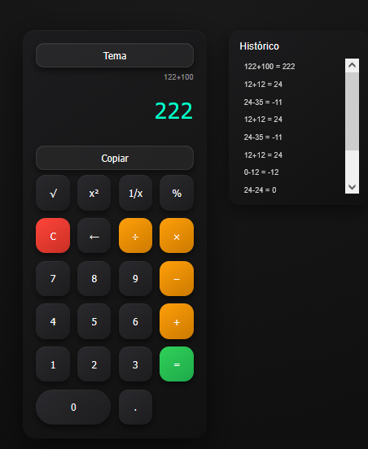

# 🧮 Calculadora Pro (PWA)

Aplicação web moderna desenvolvida com foco em arquitetura modular, experiência do usuário (UX) e performance.
Este projeto evoluiu por versões incrementais, simulando um fluxo real de desenvolvimento.

---

## 🚀 Acesse o projeto

👉 https://ruancordeirodev.github.io/calculadora-js/

---

## 🎯 Visão do Projeto

O objetivo não foi apenas criar uma calculadora, mas construir uma aplicação estruturada como produto:

* Código organizado em módulos
* Separação clara de responsabilidades
* Interface responsiva e interativa
* Experiência semelhante a apps reais

---

## 🔥 Principais Funcionalidades

* ✔ Operações matemáticas básicas (+, -, ×, ÷)
* ✔ Funções avançadas:

  * Raiz quadrada (√)
  * Potência (x²)
  * Inverso (1/x)
  * Porcentagem (%)
* ✔ Histórico de cálculos interativo
* ✔ Exibição da operação atual
* ✔ Suporte a teclado
* ✔ Tema claro/escuro
* ✔ Feedback visual (animações e erros)
* ✔ Copiar resultado
* ✔ Persistência com localStorage
* ✔ Funciona offline (PWA)

---

## 🧠 Diferenciais Técnicos

* ❌ Não utiliza `eval()`
* ✔ Implementação de parser próprio para expressões matemáticas
* ✔ Arquitetura modular separando lógica, UI e eventos
* ✔ Controle de estado simples e eficiente
* ✔ Uso estratégico do localStorage

---

## 🏗 Arquitetura

```
📦 calculadora-js
 ┣ 📂 js
 ┃ ┣ 📜 calculator.js   → Motor de cálculo (parser)
 ┃ ┣ 📜 ui.js           → Controle do display e interface
 ┃ ┣ 📜 events.js       → Eventos e interações
 ┃ ┣ 📜 history.js      → Histórico e persistência
 ┃ ┗ 📜 main.js         → Inicialização e PWA
 ┣ 📜 index.html
 ┣ 📜 style.css
 ┣ 📜 manifest.json
 ┗ 📜 service-worker.js
```

---

## 🎨 UX & Interface

O projeto foi pensado para simular comportamento de aplicações reais:

* Microinterações (animação ao calcular)
* Feedback visual para erros
* Histórico reutilizável
* Layout limpo e focado

---

## 📸 Preview



---

## 🛠 Tecnologias Utilizadas

* HTML5
* CSS3 (layout moderno + animações)
* JavaScript (Vanilla)
* Service Worker (PWA)
* LocalStorage

---

## 📈 Evolução

O projeto foi desenvolvido em múltiplas versões (V1 → V13), evoluindo:

* de lógica simples → parser próprio
* de UI básica → interface profissional
* de projeto simples → aplicação estruturada

---

## 🎯 Objetivo Profissional

Este projeto faz parte da construção do meu portfólio como desenvolvedor, com foco em:

* qualidade de código
* organização
* experiência do usuário
* aplicações reais

---

## 👨‍💻 Autor

**Ruan Cordeiro**

---

## 📌 Próximos Passos

* Modo científico completo
* Melhorias de UX
* Possível transformação em produto

---
